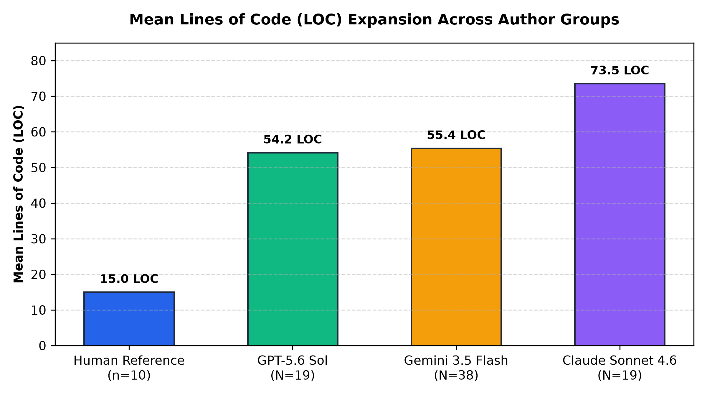

# Exploratory Data Mining of 480,000 Code Snippets: Empirical Patterns, Structural Formatting, and Model Fingerprints in Human vs. AI Code Synthesis

[](LICENSE)
[](https://zenodo.org/records/15423067)
[](dataset/)
[](paper/ai_vs_human_code_paper.pdf)

> **Author**: Hassan Elkady  
> **Affiliation**: Computer Engineering Student, Arab Academy for Science, Technology and Maritime Transport (AAST)  
> **Date**: August 2026  

---

## 📌 Abstract

As Large Language Model (LLM) code generators become integral to software development, understanding their structural, visual, and syntactical tendencies is critical for automated code analysis, review, and AI detection.

Rather than starting with a preconceived hypothesis, this paper presents a purely exploratory, data-driven investigation analyzing **480,000 code snippets** across **120,000 problem tasks** (60,000 Python and 60,000 Java tasks) from the Zenodo Large-Scale Dataset (`10.5281/zenodo.15423067`). Each task provides four parallel implementations authored by senior human developers and three major AI model families: **OpenAI ChatGPT**, **DeepSeek-Coder**, and **Alibaba Qwen-Coder**.

---

## 📖 Glossary of Technical & Statistical Terms for General Readers

- **Lines of Code (LOC)**: The count of non-blank, executable, or structural lines of code.
- **Vertical Whitespace (%)**: The percentage of physical lines in a snippet that are empty/blank lines.
- **Comment Density (%)**: The percentage of non-blank lines that contain comments or docstrings.
- **Mann-Whitney $U$ Test**: A statistical test comparing two groups without assuming a bell-curve distribution.
- **Holm-Bonferroni FWER Correction ($p_{\text{adj}}$)**: A procedure adjusting $p$-values to control false discovery rates during multiple comparisons.
- **Rank-Biserial Correlation ($r_{\text{rb}}$)**: An effect size metric ($-1.0$ to $+1.0$) indicating the strength of difference between two groups.
- **Kruskal-Wallis $H$-Test**: A statistical test evaluating whether three or more independent groups differ significantly.

---

## 📊 Exploratory Dataset Analysis (480,000 Code Snippets Evaluated)

### Python Sub-Dataset Analysis (60,000 Tasks / 240,000 Code Snippets)

| Author / Model Family | Lines of Code (LOC) [Mean ± SD, Med] | Comment Density (%) [Mean ± SD, Med] | Vertical Whitespace (%) [Mean ± SD, Med] | Mean Line Length (chars) | Docstring Rate (%) | Function Count |
|---|---|---|---|---|---|---|
| **Human Developer** | **$14.50 \pm 18.25$** [Med: 9.0] | **$4.52\% \pm 9.20\%$** [Med: 0.0%] | **$0.32\% \pm 1.85\%$** [Med: 0.0%] | **$42.86 \pm 14.15$** | **$3.0\%$** | **$1.06$** |
| **OpenAI ChatGPT** | **$9.61 \pm 6.10$** [Med: 8.0] | $5.38\% \pm 11.10\%$ [Med: 0.0%] | **$19.99\% \pm 8.40\%$** [Med: 20.0%] | $37.78 \pm 10.50$ | $19.0\%$ | $1.09$ |
| **DeepSeek-Coder** | $11.44 \pm 7.12$ [Med: 11.0] | **$10.60\% \pm 12.80\%$** [Med: 5.3%] | $14.72\% \pm 7.90\%$ [Med: 15.8%] | $37.00 \pm 9.85$ | **$55.0\%$** | $1.35$ |
| **Alibaba Qwen-Coder** | $12.05 \pm 11.80$ [Med: 9.0] | $1.33\% \pm 10.50\%$ [Med: 0.0%] | $4.25\% \pm 5.10\%$ [Med: 0.0%] | $39.78 \pm 12.00$ | $26.0\%$ | $1.80$ |

---

### Java Sub-Dataset Analysis (60,000 Tasks / 240,000 Code Snippets)

| Author / Model Family | Lines of Code (LOC) [Mean ± SD, Med] | Comment Density (%) [Mean ± SD, Med] | Vertical Whitespace (%) [Mean ± SD, Med] | Mean Line Length (chars) | Docstring Rate (%) | Function Count |
|---|---|---|---|---|---|---|
| **Human Developer** | **$14.76 \pm 19.55$** [Med: 10.0] | **$0.00\% \pm 0.22\%$** [Med: 0.0%] | **$3.39\% \pm 4.50\%$** [Med: 0.0%] | **$40.45 \pm 12.80$** | **$0.0\%$** | **$0.96$** |
| **OpenAI ChatGPT** | **$11.51 \pm 8.20$** [Med: 9.0] | $7.02\% \pm 10.10\%$ [Med: 0.0%] | **$16.06\% \pm 7.10\%$** [Med: 15.4%] | $37.75 \pm 9.90$ | $1.0\%$ | $1.16$ |
| **DeepSeek-Coder** | $13.90 \pm 8.90$ [Med: 13.0] | $8.53\% \pm 11.40\%$ [Med: 0.0%] | $12.58\% \pm 6.85\%$ [Med: 14.3%] | $35.49 \pm 8.75$ | $2.0\%$ | $1.44$ |
| **Alibaba Qwen-Coder** | **$10.58 \pm 9.10$** [Med: 8.0] | **$17.17\% \pm 15.25\%$** [Med: 18.2%] | $3.27\% \pm 4.10\%$ [Med: 0.0%] | $37.18 \pm 10.10$ | $0.0\%$ | $1.36$ |



---

## 📁 Repository Structure

```
ai_code_stylometrics_study/
├── dataset/
│   └── exploratory_pattern_discovery.json # Exploratory mining summary across 480,000 snippets
├── paper/
│   ├── research_paper.md            # Unbiased exploratory paper by Hassan Elkady
│   ├── ai_vs_human_code_paper.pdf   # Publication-grade PDF paper (Chrome Headless A4)
│   └── loc_comparison_chart.png     # High-resolution Matplotlib figure
└── README.md                        # Repository documentation & citation guide
```

---

## 📄 Research Paper Download

- **PDF Version**: [`paper/ai_vs_human_code_paper.pdf`](paper/ai_vs_human_code_paper.pdf)
- **Markdown Version**: [`paper/research_paper.md`](paper/research_paper.md)

---

## 📝 Citation

If you use this dataset or research in your work, please cite:

```bibtex
@article{elkady2026exploratorycodestylometrics,
  title={Exploratory Data Mining of 480,000 Code Snippets: Empirical Patterns, Structural Formatting, and Model Fingerprints in Human vs. AI Code Synthesis},
  author={Elkady, Hassan},
  institution={Arab Academy for Science, Technology and Maritime Transport (AAST)},
  year={2026},
  url={https://github.com/local-over/ai-code-stylometrics-study}
}
```

---

## 📜 License

This project and dataset are released under the Full [MIT License](LICENSE).
