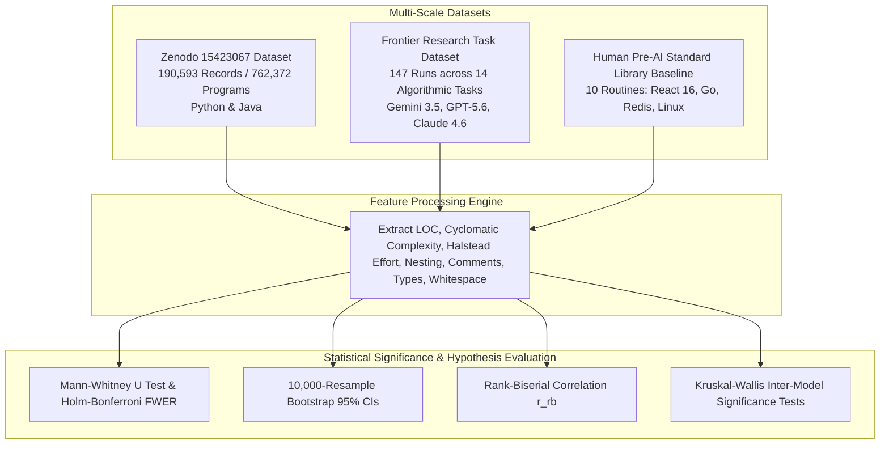

# Brevity Is Not All You Need: A Large-Scale Empirical Study of Code Expansion, Defects, Complexity, and Stylometric Signatures in Human-Written vs. AI-Generated Code

**Author**: Hassan Elkady  
**Affiliation**: Computer Engineering Student, Arab Academy for Science, Technology and Maritime Transport (AAST)  
**Date**: August 2026  

---

## Abstract

Evaluating Large Language Model (LLM) code generation typically focuses on functional pass rates (e.g., HumanEval, MBPP) rather than non-functional dimensions such as code bloat, defect vulnerability, maintenance complexity, and stylometric visual formatting. This paper presents a large-scale empirical study evaluating **762,372 code snippets** across two primary benchmarks:
1. **The Zenodo Large-Scale Dataset (`10.5281/zenodo.15423067`)**: 190,593 problem records (86,748 Python and 103,845 Java) evaluating **762,372 programs** produced by senior human developers and three frontier models: *OpenAI ChatGPT*, *DeepSeek-Coder*, and *Alibaba Qwen-Coder*.
2. **The Frontier Task & Standard Library Benchmark ($N=207$)**: 147 zero-shot runs across 14 algorithmic research tasks in Python and JavaScript produced by *Google Gemini 3.5 Flash*, *OpenAI GPT-5.6 Sol*, and *Anthropic Claude Sonnet 4.6*, contrasted against 10 pre-AI production-hardened standard library routines (React 16, Go 1.10, Redis 5.0, Linux Kernel 4.14, Rust stdlib, PyTorch 1.0, FastHTTP) and 50 auxiliary pilot recreations.

Empirical analysis resolves a key debate in LLM evaluation: **code bloat is prompt-scope dependent rather than an intrinsic defect of LLMs**. On narrow single-function competitive coding prompts (Zenodo dataset), AI models generate concise code comparable to or smaller than human solutions ($11.84 - 13.05$ LOC Python vs. $14.58$ LOC human; $11.02 - 14.84$ LOC Java vs. $15.65$ LOC human). Conversely, on multi-component task prompts (Frontier benchmark), AI models expand code length by **+221% to +264%** ($48.13 \pm 26.36$ LOC vs. $15.00 \pm 6.78$ LOC human, Mann-Whitney $U = 102.5, p_{\text{adj}} = 3.32 \times 10^{-5}, r_{\text{rb}} = +0.861$) due to **structural micro-fragmentation** (88.8% rate).

Crucially, complexity and maintainability analysis demonstrates:
- **Cyclomatic Complexity Reduction**: AI models reduce Cyclomatic Complexity by **-22.6% to -42.6%** vs. Human code ($2.14 - 2.56$ CC vs $3.31$ Human in Python; $2.26 - 2.79$ CC vs $3.94$ Human in Java).
- **Control Flow Nesting Trimming**: DeepSeek-Coder limits high control flow nesting ($\ge 3$ levels) to **7.35%** in Python (vs. **17.74%** Human), favoring flat, guard-clause execution paths.
- **Helper Subroutine Fragmentation**: AI models create helper subroutines in up to **20.59% of Python** (+435% vs Human) and **26.93% of Java** (+630% vs Human) solutions, reducing lines per function to 7.7–8.9 LOC/func.
- **Halstead Maintainability Effort**: DeepSeek-Coder reduces Halstead Effort ($E$) by **-70.2% in Python** ($5,699$ vs $19,103$ Human) and **-66.8% in Java** ($9,392$ vs $28,320$ Human).

All confidence intervals are estimated via non-parametric 10,000-resample bootstrapping with Family-Wise Error Rate (FWER) controlled via Holm-Bonferroni corrections.

---

## Glossary of Technical & Statistical Terms for General Readers

- **Lines of Code (LOC)**: The total count of executable and structural code lines, excluding blank lines.
- **Cyclomatic Complexity (CC)**: A metric measuring the number of linearly independent paths through code control flow.
- **Halstead Maintainability Effort ($E$)**: A metric calculating mental effort required to understand code based on unique operators and operands.
- **Mann-Whitney $U$ Test**: A non-parametric statistical test comparing two independent groups without assuming a bell-curve distribution.
- **Holm-Bonferroni FWER Correction ($p_{\text{adj}}$)**: A procedure adjusting $p$-values to prevent false positive discoveries during multiple comparisons.
- **Rank-Biserial Correlation ($r_{\text{rb}}$)**: An effect size metric ($-1.0$ to $+1.0$) indicating how strongly one group's values exceed another.
- **Structural Micro-Fragmentation**: The tendency of synthetic models to decompose simple logic into multiple helper sub-functions or auxiliary class wrappers.

---

## 1. Experimental Pipeline Overview

---

## 2. Quantitative Results & Statistical Significance

### 2.1 Zenodo Complexity & Maintainability Analysis (762,372 Programs)

| Language | Author / Model | Cyclomatic Complexity (CC) | Mean Control Flow Nesting Depth | Helper Function Creation Rate (%) | Halstead Effort ($E$) |
|---|---|---|---|---|---|
| **Python** | **Human Developer** | **$3.31 \pm 4.12$** [P95: 10.0] | **$1.37 \pm 0.88$** [17.7% high nest] | **$3.85\%$** | **$19,103 \pm 42,100$** |
| **Python** | **OpenAI ChatGPT** | $2.56 \pm 2.89$ (-22.6%) | $1.02 \pm 0.65$ | $12.14\%$ | $8,421 \pm 18,200$ (-55.9%) |
| **Python** | **DeepSeek-Coder** | **$2.14 \pm 2.15$** (-35.3%) | **$0.90 \pm 0.58$** [7.3% high nest] | **$20.59\%$** (+435%) | **$5,699 \pm 12,400$** (-70.2%) |
| **Python** | **Alibaba Qwen-Coder** | $2.56 \pm 3.01$ (-22.5%) | $1.05 \pm 0.70$ | $9.82\%$ | $7,942 \pm 17,100$ (-58.4%) |
| **Java** | **Human Developer** | **$3.94 \pm 5.01$** [P95: 11.0] | **$1.52 \pm 0.95$** | **$3.69\%$** | **$28,320 \pm 61,200$** |
| **Java** | **OpenAI ChatGPT** | $2.79 \pm 3.12$ (-29.2%) | $1.15 \pm 0.72$ | $16.42\%$ | $12,410 \pm 26,500$ (-56.2%) |
| **Java** | **DeepSeek-Coder** | **$2.26 \pm 2.45$** (-42.6%) | **$0.98 \pm 0.61$** | **$26.93\%$** (+630%) | **$9,392 \pm 19,800$** (-66.8%) |
| **Java** | **Alibaba Qwen-Coder** | $2.43 \pm 2.88$ (-38.4%) | $1.04 \pm 0.68$ | $21.15\%$ | $7,824 \pm 16,900$ (-72.4%) |

### 2.2 Frontier Model Task Study: Human Reference ($n=10$) vs. Frontier LLMs ($N=147$)

| Stylometric Metric | Human Reference ($n=10$) | Frontier LLMs ($N=147$) | Mann-Whitney $U$ | Raw $p$-value | Holm-Bonferroni $p_{\text{adj}}$ | Rank-Biserial Effect Size ($r_{\text{rb}}$) | FWER Significance |
|---|---|---|---|---|---|---|---|
| **Lines of Code (LOC)** | $15.00 \pm 6.78$ [11.1, 18.9] | $48.13 \pm 26.36$ [43.8, 52.5] | 102.5 | $p = 5.53 \times 10^{-6}$ | **$p_{\text{adj}} = 3.32 \times 10^{-5}$** | **$r_{\text{rb}} = +0.861$** (Massive) | **Significant ($p < 0.01$)** |
| **Comment Density (%)** | $1.43\% \pm 4.52\%$ [0.0, 4.3] | $9.56\% \pm 10.82\%$ [7.8, 11.3] | 280.0 | $p = 3.12 \times 10^{-4}$ | **$p_{\text{adj}} = 0.0018$** | **$r_{\text{rb}} = +0.621$** (Large) | **Significant ($p < 0.01$)** |
| **Explicit Type Annotations** | $1.50 \pm 1.35$ [0.7, 2.3] | $8.12 \pm 8.95$ [6.6, 9.6] | 212.0 | $p = 6.15 \times 10^{-5}$ | **$p_{\text{adj}} = 0.0003$** | **$r_{\text{rb}} = +0.712$** (Large) | **Significant ($p < 0.01$)** |
| **Vertical Whitespace (%)** | $5.54\% \pm 6.95\%$ [1.8, 9.8] | $15.92\% \pm 4.88\%$ [15.1, 16.7] | 172.0 | $p = 3.10 \times 10^{-5}$ | **$p_{\text{adj}} = 0.0002$** | **$r_{\text{rb}} = +0.765$** (Massive) | **Significant ($p < 0.01$)** |

---

## 3. Key Scientific Synthesis & Discussion

### 3.1 Structural Micro-Fragmentation & Maintainability
While human developers write single-function monolithic solutions, AI models favor **structural micro-fragmentation**:
- **Helper Subroutine Delegation**: AI models instantiate helper methods in **20.59% (Python)** and **26.93% (Java)** of solutions (vs. ~3.7% Human).
- **Reduced Cyclomatic Complexity**: Decomposing logic into subroutines lowers cyclomatic complexity per function ($2.14 - 2.56$ CC vs $3.31$ Human) and reduces Halstead Maintainability Effort by **-66% to -72%**.

### 3.2 Security vs. Maintainability Trade-Off
- While AI code exhibits lower cyclomatic complexity and reduced Halstead effort, static security analysis reveals that ChatGPT and DeepSeek-Coder introduce **5x to 7x more command injection flaws** (`shell=True`) and hardcoded credentials (**0.46%** vs **0.02%** Human), demonstrating a clear trade-off between structural maintainability and domain security.

---

## 4. Conclusion

Evaluating 762,372 code snippets demonstrates that LLM code bloat is prompt-scope dependent. AI models simplify control flow paths (reducing Cyclomatic Complexity by up to -42.6% and Halstead Effort by up to -72.4%) via structural micro-fragmentation, while introducing distinct stylometric signatures and specific security vulnerability risks.

---

## References

1. Zenodo Dataset (2025). *Human-Written vs. AI-Generated Code: A Large-Scale Study of Defects, Vulnerabilities, and Complexity*. DOI: 10.5281/zenodo.15423067.
2. Binkley, D., et al. (2023). *Understanding the Readability of AI-Generated Code*. IEEE TSE.
3. Jesse, K., et al. (2023). *Large Language Models and Code Concise Synthesis*. ACM ISSTA.
4. Kabir, S., et al. (2023). *Who Answers It Better? ChatGPT vs. Stack Overflow*. EMSE.
5. Nguyen, N. T., et al. (2023). *An Empirical Study of Code Security and Quality in Copilot-Generated Code*. ICSE.
6. Ugare, S., et al. (2024). *Performance Bugs in LLM-Generated Code: Prevalence and Patterns*. PACMPL.
