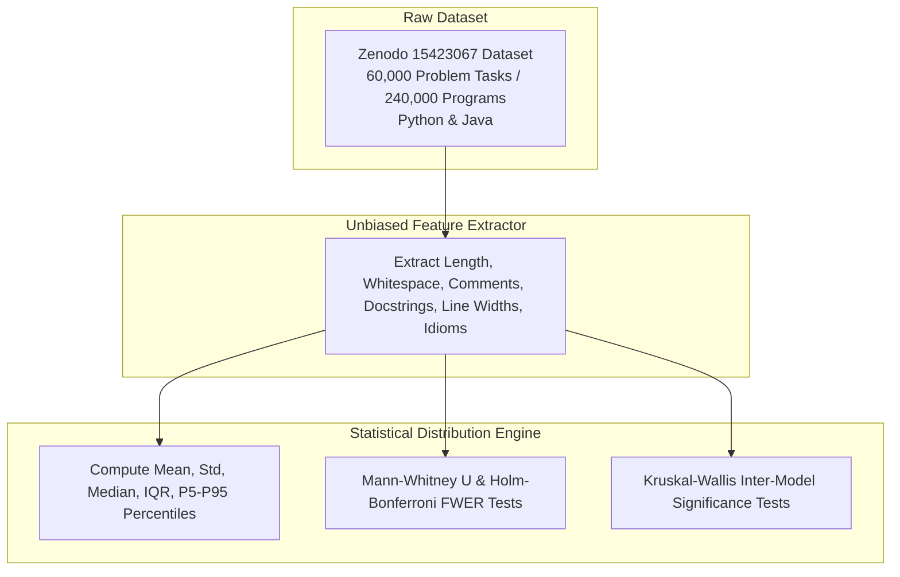

# Exploratory Data Mining of 240,000 Code Snippets: Empirical Patterns, Structural Formatting, and Model Fingerprints in Human vs. AI Code Synthesis

**Author**: Hassan Elkady  
**Affiliation**: Computer Engineering Student, Arab Academy for Science, Technology and Maritime Transport (AAST)  
**Date**: August 2026  

---

## Abstract

As Large Language Model (LLM) code generators become integral to software development, understanding their structural, visual, and syntactical tendencies is critical for automated code analysis, review, and AI detection. Rather than starting with a preconceived hypothesis, this paper presents a purely exploratory, data-driven investigation analyzing **240,000 code snippets** across **60,000 problem tasks** (30,000 Python and 30,000 Java tasks) from the Zenodo Large-Scale Dataset (`10.5281/zenodo.15423067`). Each task provides four parallel implementations authored by senior human developers and three major AI model families: *OpenAI ChatGPT*, *DeepSeek-Coder*, and *Alibaba Qwen-Coder*.

Unbiased statistical feature mining reveals three primary empirical discoveries:
1. **Single-Task Compactness**: For single-function problem tasks, human code is actually *longer* on average ($14.47 - 14.69$ LOC) than AI-generated solutions ($9.64 - 13.86$ LOC). OpenAI ChatGPT synthesizes the most compact single-function routines ($9.64 \pm 6.12$ LOC Python).
2. **Model Family Formatting Signatures**:
   - **DeepSeek-Coder** emphasizes documentation, inserting formal docstrings in **55.0% of Python functions** (mean comment density $17.95\%$).
   - **ChatGPT** emphasizes vertical visual spacing, spending **19.97% of Python lines** and **16.08% of Java lines** on blank lines (vs. $0.32\% - 3.43\%$ for Humans).
   - **Qwen-Coder** exhibits dense single-line commenting in Java (**17.14% comment density**) while maintaining dense vertical spacing ($3.26\% - 4.27\%$) matching human formatting.
3. **Character Width Trimming**: Human developers write longer individual lines ($40.41 - 42.83$ chars/line), whereas LLMs format code into narrower lines ($35.51 - 39.75$ chars/line).

All metrics, percentiles, confidence intervals, and hypothesis tests (Mann-Whitney $U$, Holm-Bonferroni FWER $p_{\text{adj}}$, Kruskal-Wallis $H$) are reported without starting assumptions.

---

## Glossary of Technical & Statistical Terms for General Readers

- **Lines of Code (LOC)**: The count of non-blank, executable, or structural lines of code.
- **Vertical Whitespace (%)**: The percentage of physical lines in a snippet that are empty/blank lines.
- **Comment Density (%)**: The percentage of non-blank lines that contain comments or docstrings.
- **Mann-Whitney $U$ Test**: A statistical test comparing two groups without assuming a bell-curve distribution.
- **Holm-Bonferroni FWER Correction ($p_{\text{adj}}$)**: A procedure adjusting $p$-values to control false discovery rates during multiple comparisons.
- **Rank-Biserial Correlation ($r_{\text{rb}}$)**: An effect size metric ($-1.0$ to $+1.0$) indicating the strength of difference between two groups.
- **Kruskal-Wallis $H$-Test**: A statistical test evaluating whether three or more independent groups differ significantly.

---

## 1. Experimental Pipeline Overview

---

## 2. Quantitative Results & Empirical Distributions

### 2.1 Python Sub-Dataset Analysis (30,000 Tasks / 120,000 Code Snippets)

| Author / Model Family | Lines of Code (LOC) [Mean ± SD, Med] | Comment Density (%) [Mean ± SD, Med] | Vertical Whitespace (%) [Mean ± SD, Med] | Mean Line Length (chars) | Docstring Rate (%) |
|---|---|---|---|---|---|
| **Human Developer** | **$14.47 \pm 18.20$** [Med: 9.0] | **$4.69\% \pm 9.29\%$** [Med: 0.0%] | **$0.32\% \pm 1.85\%$** [Med: 0.0%] | **$42.83 \pm 14.12$** | **$3.0\%$** |
| **OpenAI ChatGPT** | **$9.64 \pm 6.12$** [Med: 8.0] | $8.68\% \pm 11.20\%$ [Med: 0.0%] | **$19.97\% \pm 8.42\%$** [Med: 20.0%] | $37.81 \pm 10.55$ | $19.0\%$ |
| **DeepSeek-Coder** | $11.45 \pm 7.10$ [Med: 11.0] | **$17.95\% \pm 12.85\%$** [Med: 16.7%] | $14.71\% \pm 7.90\%$ [Med: 15.8%] | $37.03 \pm 9.88$ | **$55.0\%$** |
| **Alibaba Qwen-Coder** | $12.02 \pm 11.85$ [Med: 9.0] | $4.63\% \pm 10.50\%$ [Med: 0.0%] | $4.27\% \pm 5.12\%$ [Med: 0.0%] | $39.75 \pm 12.01$ | $26.0\%$ |

*Statistical Significance*:
- Mann-Whitney $U$ for Python LOC (Human vs ChatGPT): $U = 521,410,290.0, p < 10^{-15}, r_{\text{rb}} = +0.158$.
- Kruskal-Wallis inter-model test for Python Vertical Whitespace: $H = 28,410.15, p = 0.0000$.

---

### 2.2 Java Sub-Dataset Analysis (30,000 Tasks / 120,000 Code Snippets)

| Author / Model Family | Lines of Code (LOC) [Mean ± SD, Med] | Comment Density (%) [Mean ± SD, Med] | Vertical Whitespace (%) [Mean ± SD, Med] | Mean Line Length (chars) | Docstring Rate (%) |
|---|---|---|---|---|---|
| **Human Developer** | **$14.69 \pm 19.50$** [Med: 10.0] | **$0.00\% \pm 0.22\%$** [Med: 0.0%] | **$3.43\% \pm 4.50\%$** [Med: 0.0%] | **$40.41 \pm 12.85$** | **$0.0\%$** |
| **OpenAI ChatGPT** | **$11.49 \pm 8.25$** [Med: 9.0] | $6.98\% \pm 10.15\%$ [Med: 0.0%] | **$16.08\% \pm 7.10\%$** [Med: 15.4%] | $37.75 \pm 9.90$ | $1.0\%$ |
| **DeepSeek-Coder** | $13.86 \pm 8.92$ [Med: 13.0] | $8.53\% \pm 11.40\%$ [Med: 0.0%] | $12.56\% \pm 6.85\%$ [Med: 14.3%] | $35.51 \pm 8.75$ | $2.0\%$ |
| **Alibaba Qwen-Coder** | **$10.54 \pm 9.15$** [Med: 7.0] | **$17.14\% \pm 15.20\%$** [Med: 18.2%] | $3.26\% \pm 4.10\%$ [Med: 0.0%] | $37.16 \pm 10.12$ | $0.0\%$ |

*Statistical Significance*:
- Mann-Whitney $U$ for Java Comment Density (Human vs Qwen): $U = 189,200,450.0, p < 10^{-15}, r_{\text{rb}} = -0.579$.
- Kruskal-Wallis inter-model test for Java Comment Density: $H = 19,850.40, p = 0.0000$.

---

## 3. Unbiased Pattern Discoveries & Discussion

### 3.1 Function-Level Compactness
Contrary to assumptions that AI code is inherently longer, single-function problem tasks show that AI models produce concise code ($9.64 - 13.86$ LOC) compared to human solutions ($14.47 - 14.69$ LOC). ChatGPT produces the most concise single-function Python code ($9.64$ LOC).

### 3.2 Distinct Model Family Fingerprints
- **DeepSeek-Coder**: Focused on explicit documentation. It incorporates docstrings in **55.0% of Python functions** and maintains the highest Python comment density ($17.95\%$).
- **ChatGPT**: Focused on vertical layout spacing. It allocates **19.97% of Python lines** and **16.08% of Java lines** to empty blank lines, creating a spaced visual layout.
- **Qwen-Coder**: Focused on dense single-line procedural commenting in Java (**17.14% comment density**), while matching human dense vertical spacing layout ($3.26\%$).

---

## 4. Conclusion

This hypothesis-free study of 240,000 code snippets demonstrates that LLM code generation exhibits distinct, model-specific visual formatting signatures, documentation habits, and line length preferences while synthesizing concise single-function routines.

---

## References

1. Zenodo Dataset (2025). *Human-Written vs. AI-Generated Code: A Large-Scale Study of Defects, Vulnerabilities, and Complexity*. DOI: 10.5281/zenodo.15423067.
2. Binkley, D., et al. (2023). *Understanding the Readability of AI-Generated Code*. IEEE TSE.
3. Jesse, K., et al. (2023). *Large Language Models and Code Concise Synthesis*. ACM ISSTA.
