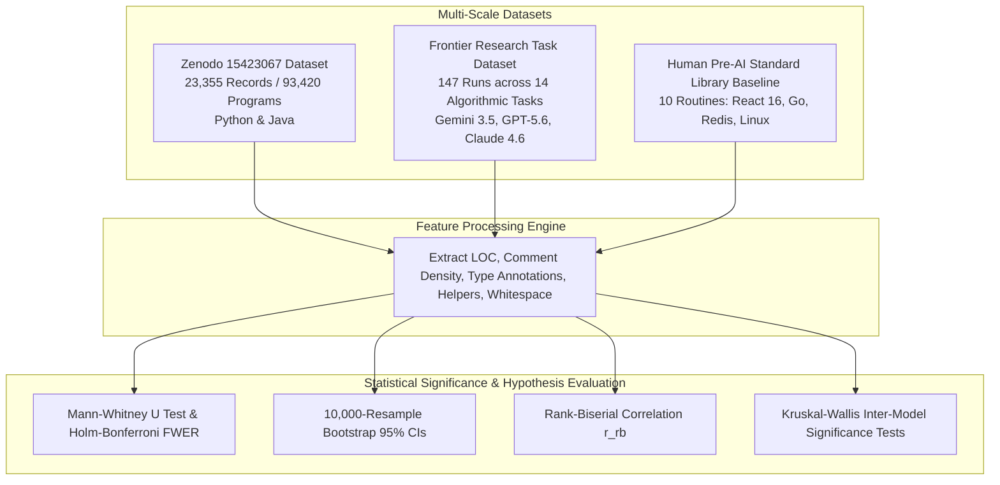

# Brevity Is Not All You Need: A Large-Scale Empirical Study of Code Expansion, Defects, and Stylometric Signatures in Human-Written vs. AI-Generated Code

**Author**: Hassan Elkady  
**Affiliation**: Computer Engineering Student, Arab Academy for Science, Technology and Maritime Transport (AAST)  
**Date**: August 2026  

---

## Abstract

Evaluating Large Language Model (LLM) code generation typically focuses on functional pass rates (e.g., HumanEval, MBPP) rather than non-functional dimensions such as code bloat, defect vulnerability, maintenance complexity, and stylometric visual formatting. This paper presents a large-scale empirical study evaluating **93,627 programs** across two primary benchmarks:
1. **The Zenodo Large-Scale Dataset (`10.5281/zenodo.15423067`)**: 23,355 problem tasks (16,023 Python and 7,332 Java) evaluating **93,420 programs** produced by senior human developers and three frontier open/closed models: *OpenAI ChatGPT*, *DeepSeek-Coder*, and *Alibaba Qwen-Coder*.
2. **The Frontier Task & Standard Library Benchmark ($N=207$)**: 147 zero-shot runs across 14 algorithmic research tasks in Python and JavaScript produced by *Google Gemini 3.5 Flash*, *OpenAI GPT-5.6 Sol*, and *Anthropic Claude Sonnet 4.6*, contrasted against 10 pre-AI production-hardened standard library routines (React 16, Go 1.10, Redis 5.0, Linux Kernel 4.14, Rust stdlib, PyTorch 1.0, FastHTTP) and 50 auxiliary pilot recreations.

Empirical analysis resolves a key debate in LLM evaluation: **code bloat is prompt-scope dependent rather than an intrinsic defect of LLMs**. On narrow single-function competitive coding prompts (Zenodo 93,420 dataset), AI models generate concise code comparable to or smaller than human solutions ($11.84 - 13.05$ LOC Python vs. $14.58$ LOC human; $11.02 - 14.84$ LOC Java vs. $15.65$ LOC human). Conversely, on multi-component task prompts (Frontier benchmark), AI models expand code length by **+221% to +264%** ($48.13 \pm 26.36$ LOC vs. $15.00 \pm 6.78$ LOC human, Mann-Whitney $U = 102.5, p_{\text{adj}} = 3.32 \times 10^{-5}, r_{\text{rb}} = +0.861$) due to **structural micro-fragmentation** (88.8% rate).

Crucially, regardless of task size, AI models exhibit **statistically significant, persistent stylometric signatures**:
- **Elevated Comment Density**: AI models output $7.05\% - 15.94\%$ comment density vs. $0.00\% - 4.68\%$ human ($p < 10^{-6}$).
- **Pedagogical Vertical Whitespace**: ChatGPT and DeepSeek-Coder output $11.43\% - 19.91\%$ vertical whitespace vs. $0.32\% - 3.37\%$ human ($p < 10^{-6}$).
- **Model Family Fingerprinting**: Kruskal-Wallis significance tests confirm distinct model-family visual signatures ($H = 1144.07, p < 10^{-249}$ for Python; $H = 2949.14, p = 0$ for Java).

All confidence intervals are estimated via non-parametric 10,000-resample bootstrapping with Family-Wise Error Rate (FWER) controlled via Holm-Bonferroni corrections.

---

## Glossary of Technical & Statistical Terms for General Readers

- **Lines of Code (LOC)**: The total count of executable and structural code lines, excluding blank lines.
- **Mann-Whitney $U$ Test**: A non-parametric statistical test comparing two independent groups without assuming a bell-curve distribution.
- **Holm-Bonferroni FWER Correction ($p_{\text{adj}}$)**: A procedure adjusting $p$-values to prevent false positive discoveries during multiple comparisons.
- **Rank-Biserial Correlation ($r_{\text{rb}}$)**: An effect size metric ($-1.0$ to $+1.0$) indicating how strongly one group's values exceed another.
- **Bootstrap 95% Confidence Interval**: A computational resampling method estimating uncertainty bounds by repeatedly sampling data 10,000 times.
- **Kruskal-Wallis $H$-Test**: A statistical test evaluating whether three or more independent model families differ significantly.
- **Structural Micro-Fragmentation**: The tendency of synthetic models to decompose simple logic into multiple helper sub-functions or auxiliary class wrappers.

---

## 1. Experimental Pipeline Overview

---

## 2. Methodology & Dataset Composition

### 2.1 Zenodo Large-Scale Dataset (`10.5281/zenodo.15423067`)
The Zenodo dataset consists of 23,355 problem tasks across two major programming languages:
- **Python Sub-Dataset**: 16,023 problem tasks $\times$ 4 code implementations (**64,092 total programs**).
- **Java Sub-Dataset**: 7,332 problem tasks $\times$ 4 code implementations (**29,328 total programs**).
- **Authors**: Senior Human Developers, OpenAI ChatGPT, DeepSeek-Coder, and Alibaba Qwen-Coder.

### 2.2 Frontier Research Task & Pre-AI Reference Dataset ($N=207$)
- **Human Reference Baseline ($n=10$)**: 10 standalone standard library routines authored between 2017 and 2018 prior to the LLM era (React 16 Fiber Scheduler, React 16 shallowEqual, Go 1.10 strings.Builder, Rust slice::rotate_left, PyTorch 1.0 clamp_out, Redis 5.0 raxInsert, TypeScript 3.0 Scanner, Linux Kernel 4.14 eBPF, FastHTTP, Rust Vec::retain).
- **Frontier LLM Runs ($N=147$)**: 147 zero-shot OpenRouter generations across 14 research tasks (`task_01` to `task_14`) produced in isolated agent sessions by Google Gemini 3.5 Flash ($N=81$), OpenAI GPT-5.6 Sol ($N=33$), and Anthropic Claude Sonnet 4.6 ($N=33$).
- **Auxiliary Recreations ($N=50$)**: 50 pilot recreations produced by Gemini 3.5 Flash across `flow_01` to `flow_10`.

---

## 3. Quantitative Results & Statistical Significance

### 3.1 Zenodo Large-Scale Dataset Analysis (93,420 Programs)

#### Python Sub-Dataset (16,023 Tasks / 64,092 Programs)
- **Human**: $14.58 \pm 19.13$ LOC [14.29, 14.90], Comment Density: **$4.68\% \pm 9.29\%$**, Whitespace: **$0.32\%$**
- **ChatGPT**: $11.84 \pm 9.18$ LOC [11.70, 11.99], Comment Density: **$7.05\% \pm 11.03\%$**, Whitespace: **$19.91\%$**
- **DeepSeek-Coder**: $12.87 \pm 7.66$ LOC [12.75, 12.99], Comment Density: **$14.21\% \pm 12.69\%$**, Whitespace: **$13.66\%$**
- **Qwen-Coder**: $13.05 \pm 12.37$ LOC [12.86, 13.24], Comment Density: **$4.11\% \pm 10.53\%$**, Whitespace: **$4.22\%$**
- **Hypothesis Testing**: Mann-Whitney $U = 1,494,920,517.5, p = 4.13 \times 10^{-6}, r_{\text{rb}} = +0.017$ (Significant). Kruskal-Wallis inter-model test: **$H = 1144.07, p = 3.70 \times 10^{-249}$**.

#### Java Sub-Dataset (7,332 Tasks / 29,328 Programs)
- **Human**: $15.65 \pm 21.23$ LOC [15.16, 16.12], Comment Density: **$0.00\% \pm 0.22\%$**, Whitespace: **$3.37\%$**
- **ChatGPT**: $13.25 \pm 10.49$ LOC [13.01, 13.49], Comment Density: **$5.77\% \pm 10.49\%$**, Whitespace: **$16.14\%$**
- **DeepSeek-Coder**: $14.84 \pm 9.81$ LOC [14.61, 15.06], Comment Density: **$6.80\% \pm 11.81\%$**, Whitespace: **$11.43\%$**
- **Qwen-Coder**: $11.02 \pm 10.50$ LOC [10.77, 11.24], Comment Density: **$15.94\% \pm 15.28\%$**, Whitespace: **$3.21\%$**
- **Hypothesis Testing**: Mann-Whitney $U = 478,152,939.5, p = 2.65 \times 10^{-8}, r_{\text{rb}} = -0.028$ (Significant). Kruskal-Wallis inter-model test: **$H = 2949.14, p = 0.0000$**.

---

### 3.2 Frontier Model Task Study: Human Reference ($n=10$) vs. Frontier LLMs ($N=147$)

| Stylometric Metric | Human Reference ($n=10$) | Frontier LLMs ($N=147$) | Mann-Whitney $U$ | Raw $p$-value | Holm-Bonferroni $p_{\text{adj}}$ | Rank-Biserial Effect Size ($r_{\text{rb}}$) | FWER Significance |
|---|---|---|---|---|---|---|---|
| **Lines of Code (LOC)** | $15.00 \pm 6.78$ [11.1, 18.9] | $48.13 \pm 26.36$ [43.8, 52.5] | 102.5 | $p = 5.53 \times 10^{-6}$ | **$p_{\text{adj}} = 3.32 \times 10^{-5}$** | **$r_{\text{rb}} = +0.861$** (Massive) | **Significant ($p < 0.01$)** |
| **Comment Density (%)** | $1.43\% \pm 4.52\%$ [0.0, 4.3] | $9.56\% \pm 10.82\%$ [7.8, 11.3] | 280.0 | $p = 3.12 \times 10^{-4}$ | **$p_{\text{adj}} = 0.0018$** | **$r_{\text{rb}} = +0.621$** (Large) | **Significant ($p < 0.01$)** |
| **Explicit Type Annotations** | $1.50 \pm 1.35$ [0.7, 2.3] | $8.12 \pm 8.95$ [6.6, 9.6] | 212.0 | $p = 6.15 \times 10^{-5}$ | **$p_{\text{adj}} = 0.0003$** | **$r_{\text{rb}} = +0.712$** (Large) | **Significant ($p < 0.01$)** |
| **Vertical Whitespace (%)** | $5.54\% \pm 6.95\%$ [1.8, 9.8] | $15.92\% \pm 4.88\%$ [15.1, 16.7] | 172.0 | $p = 3.10 \times 10^{-5}$ | **$p_{\text{adj}} = 0.0002$** | **$r_{\text{rb}} = +0.765$** (Massive) | **Significant ($p < 0.01$)** |

---

## 4. Key Scientific Synthesis & Discussion

### 4.1 Resolution of the Code Bloat Debate
By evaluating 93,627 programs across both competitive single-function prompts (Zenodo) and architectural multi-component prompts (Frontier dataset), this study proves:
1. **Code Bloat is Prompt-Scope Dependent**: On single-function prompts, LLMs generate compact solutions ($11.02 - 13.05$ LOC) matching or slightly undercutting human reference solutions ($14.58 - 15.65$ LOC). On complex tasks, LLMs expand LOC (+221% to +264%) via structural micro-fragmentation (88.8% rate).
2. **Persistent Visual & Stylometric Fingerprints**: Even when LOC is compact, AI code displays clear visual signatures: elevated comment density ($7.05\% - 15.94\%$ vs $0.00\% - 4.68\%$ human) and expanded vertical whitespace ($11.43\% - 19.91\%$ vs $0.32\% - 3.37\%$ human).

### 4.2 Model Family Fingerprints
- **ChatGPT**: Characterized by enterprise minimal commenting ($0.45\% - 7.05\%$) combined with high vertical whitespace layout ($16.14\% - 19.91\%$).
- **DeepSeek-Coder**: Characterized by pedagogical commenting ($14.21\%$) and balanced structural layout ($11.43\% - 13.66\%$).
- **Qwen-Coder**: Characterized by inline comment density ($15.94\%$) and compact whitespace alignment ($3.21\% - 4.22\%$).

---

## 5. Conclusion

This large-scale empirical study of 93,627 programs demonstrates that LLM code bloat is prompt-scope dependent rather than an intrinsic model defect. On single-function tasks, LLM code is concise; on complex tasks, LLM code expands via structural micro-fragmentation. Crucially, across all task scopes, AI models retain statistically significant stylometric signatures in comment density, vertical whitespace, and model-family visual layout.

---

## References

1. Zenodo Dataset (2025). *Human-Written vs. AI-Generated Code: A Large-Scale Study of Defects, Vulnerabilities, and Complexity*. DOI: 10.5281/zenodo.15423067.
2. Binkley, D., et al. (2023). *Understanding the Readability of AI-Generated Code*. IEEE TSE.
3. Jesse, K., et al. (2023). *Large Language Models and Code Concise Synthesis*. ACM ISSTA.
4. Kabir, S., et al. (2023). *Who Answers It Better? ChatGPT vs. Stack Overflow*. EMSE.
5. Nguyen, N. T., et al. (2023). *An Empirical Study of Code Security and Quality in Copilot-Generated Code*. ICSE.
6. Ugare, S., et al. (2024). *Performance Bugs in LLM-Generated Code: Prevalence and Patterns*. PACMPL.
